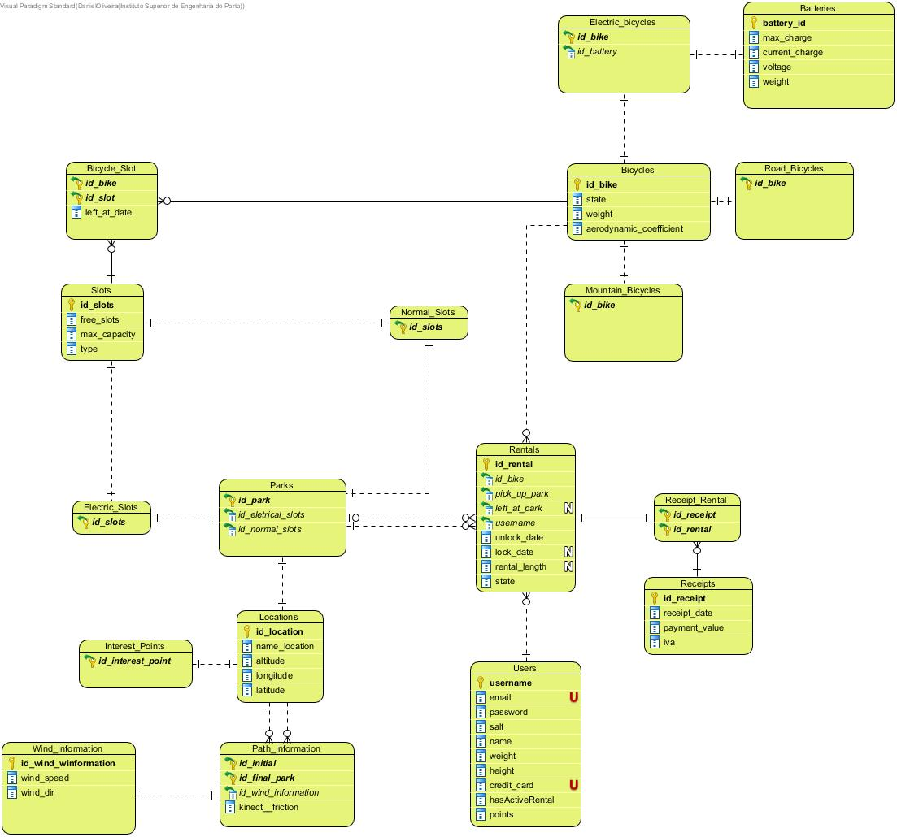

# OO Design

## Realization of the Use Cases(SD + CD)

| UC  | Description                                                             |                   
|:----|:------------------------------------------------------------------------|
| UC01 | [Delete Park](Design/UC01-DeletePark.md)
| UC02 | [Delete Bicycle](Design/UC02-DeleteBicycle.md)
| UC03 | [Update Bicycle](Design/UC03-UpdateBicycle.md)
| UC04 | [Update Park](Design/UC04-UpdatePark.md)
| UC05 | [Create Park](Design/UC05-CreatePark.md)
| UC06 | [Create Bicycle](Design/UC06-CreateBicycle.md)
| UC07 | [Check Space In Park To Lock Bicycle](Design/UC07-CheckSpaceInParkToLockBicycle.md)
| UC08 | [Lock Bicycle](Design/UC08-LockBicycle.md)
| UC09 | [Create User](Design/UC09-CreateUser.md)
| UC10 | [List Available Bicycles In Park](Design/UC10-ListAvailableBicyclesInPark.md)
| UC11 | [List Parks Near User](Design/UC11-ListParksNearUser.md)
| UC12 | [Calculate Burnt Calories In Travel](Design/UC12-CalculateBurntCalories.md)
| UC13 | [Calculate Distance From User To Park](Design/UC13-CalculateDistanceFromUserToPark.md)
| UC14 | [Calculate Electrical Energy Spent In Travel](Design/UC14-CalculateElectricalEnergySpentInTravel.md)
| UC15 | [Unlock Bicycle](Design/UC15-UnlockBicycle.md)
| UC16 | [Create Interest Point](Design/UC16-CreateInterestPoint.md)
| UC17 | [Delete Interest Point](Design/UC17-DeleteInterestPoint.md)
| UC18 | [Update Interest Point](Design/UC18-UpdateInterestPoint.md)
| UC19 | [Generate Report](Design/UC19-GenerateReport.md)
| UC20 | [Award User Points](Design/UC20-AwardUserPoints.md)
| UC21 | [Shortest Path Points Interest](Design/UC21-ShortestPathInterest.md)
| UC22 | [Shortest Route Distance Park](Design/UC22-ShortestRouteDistancePark.md)
| UC23 | [Park Updates With Bicycle Lock](Design/UC23-ParkUpdatesWithBicycleLock.md)
| UC24 | [Rental Payment](Design/UC24-RentalPayment.md)
| UC25 | [Discount User's Fee with Points](Design/UC25-DiscountUserFeeWithPoints.md)
| UC26 | [Shortest Path By Electrical Efficiency](Design/UC26-ShortestPathElectricalEfficiency.md)
| UC27 | [Write Point of Interest File](Design/UC27-WritePois.md)
| UC28 | [Read Park File](Design/UC28-ReadParkFile.md)
| UC29 | [Write Bicycle File](Design/UC29-WriteBicycle.md)
| UC30 | [Write Path File](Design/UC30-WritePath.md)
| UC31 | [Read Interest Point File](Design/UC31-ReadInterestPointFile.md)
| UC32 | [Read User File](Design/UC32-ReadUserFile.md)
| UC33 | [Add Wind Information](Design/UC33-AddWindInformation.md)
| UC34 | [Add Path Information](Design/UC34-AddPathInformation.md)
| UC35 | [Read Path File](Design/UC35-ReadPathFile.md)
| UC36 | [Read Bicycle File](Design/UC36-ReadBicycleFile.md)
| UC37 | [Update Path Information](Design/UC37-UpdatePathInformation.md)

## Entity Relationship Diagram (ERD)

#### [Back](/Readme.md)
