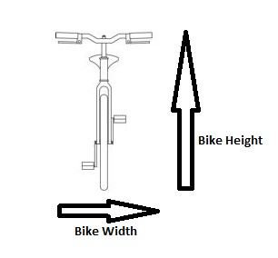
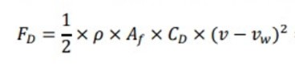
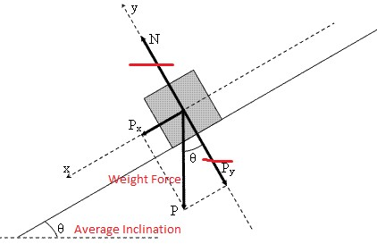
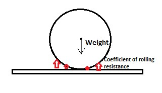
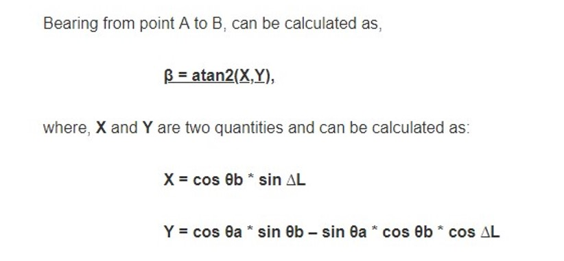
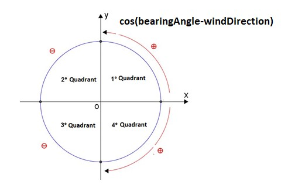
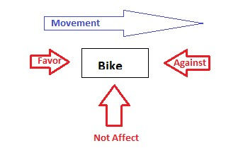

# Physics Algorithms 

Given that some of the software’s core functionalities rely on various calculations involving physics algorithms, we decided it was best to have this specific section within our report, in order to better explain how these distinct features function. 

However, since we use various physical constants throughout these functionalities, we thought it was best to first disclose all of them.  

 

## Constants: 

  - *EARTH_RADIUS* = 6371 km : it is present on the Haversine formula; 

  - *USER_CONTACT_WITH_AIR_PERC* = 0.33 : percentage of the person in contact with the air; 

  - *GRAVITY* = 9.8 m/s   

  - *BIKE_WIDTH* = 0.41 m; 

  - *BIKE_HEIGHT* = 1.02 m; 

  - *ATMOSPHERIC_DENSITY* = 1.225 : density of the air in 15ºC on the sea level (Kg/m^3); 

  - *WIND_LOAD_FORMULA_CONSTANT* = 0.5 : constant of drag force formula; 

  - *ROLLING_RESISTANCE* = 0.0045 : force resisting motion when a bicycle rolls on a surface (unsigned);

  - *ELETRIC_YIELD* = 0.8 : 80% of the power is used, the rest is dissipated; 

  - *BIKE_SPEED* = 22.5 m/s : average speed; 

 

## Methods: 

Now that all relevant constants are identified, we will now discuss each physics method’s behavior. 

### calculateAvailableEnergy: 

Variables:  

  - *voltage*: voltage of the bicycle. 

  - *currentCharge*: current charge of the bicycle. 

This method is used to calculate the total energy that is available on a bicycle’s battery. 

### calculateMechanicalPower: 

Variables: 

  - *bikeSpeed*: speed of the bicycle. 

This method calculates the power needed to move the bicycle and returns the product between the resistive force and the bicycle’s speed. 

### calculateElectricPowerUsed: 

Variables: 

  - *totalWeight*: sum of the bicycle's and user’s weight used in the calculation of the *mechanicalPower* method. 

This method calculates the electric power used by a bike between two points, this method returns the quotient between the mechanical power and the electric yield. 

###calculateArea: 

Variables: 

  - *bikeWidth*: width of the bicycle’s handlebars 

  - *totalHeight*: sum of both the bicycle’s and user’s height 

This method calculates the area of contact between both the user and the bicycle with the air. 

 

 

**(*Figure 8 – Total Area of Contact*)** 

 

### calculateDragForce: 

Variables: 

  - *speed*: difference between the bicycle’s speed and the wind’s speed 

  - *dragCoefficient*: dimensionless value used to quantify the resistance of an object in a fluid environment. 

This method implements the drag force formula, as seen in the figure below: 

 

 

**(*Figure 9 – Drag Force Formula*)** 

### calculateGraviticForce: 

Variables: 

  - *averageElevation*: absolute difference between final and initial elevations. 

  - *distance*:  obtained with *distance* method

  - *inclination*: quotient between the elevation and distance, presented in degrees 

This method allows the calculation of the gravitational force, given the weight force and the inclination of the path. It is relevant to note that for the inclination it's used an average. 

 

 

**(*Figure 10 – Demonstration of the Gravitational Force*)** 

 

### calculateBearingResistance: 

This method calculates the bearing resistance by multiplying the weight force with the coefficient of rolling resistance.  

 

 

**(*Figure 11 – Demonstration of the Bearing Resistance*)** 

 

### calculateWeightForce: 

Variables: 

  - *gravity*: constant (9.8 m/s) 

  - *totalWeight*: sum of user's and bicycle's weight 

This method returns the x component of the weight force, which is the product between gravity and the total weight. 

 

 

**(*Figure 12 – Demonstration of the Weight Force*)** 

 

### calculateBearingAngle: 

Variables: 

  - *x*: obtained with the calculation below and the respective coordinates of location 1 

  - *y*: obtained with the calculation below and the respective coordinates of location 2 

This method calculates the bearing angle using the following calculations:

 

 

**(*Figure 13 – Demonstration of the Bearing Angle Calculations*)** 

 

### calculateWindDirection: 

Variables: 

  - *bearingAngle*: angle in degrees representative of the heading direction. 

  - *windDirection*: angle in degrees representative of the wind direction. 

This method returns the wind direction. 

If the angle obtained with the difference between *bearingAngle* and *windDirection* is ninety (90), we can conclude the wind does not interfer with the movement, meaning it won’t affect the calculation of the wind direction, so the method returns zero (0). 

However, if the angle obtained with the difference between *bearingAngle* and *windDirection* is greater than zero (0), we can conclude the wind is favourable to the movement, meaning the drag force is a resistive force, so the method returns one (1). 

Additionally, if the angle obtained with the difference between *bearingAngle* and *windDirection* is smaller than zero (0), we can conclude the wind is not favourable to the movement, meaning the drag force is a resistive force, so the method returns minus one (-1). 

 

 

**(*Figure 14 – Demonstration of the Wind Direction Angle*)** 

### calculateResistiveForce: 

Variables: 

  - *area*: area used in the calculation of the drag force 

  - *weightForce*: weight force used in the calculation of the gravitational force and the bearing resistance 

  - *dragForce*: obtained with *calculateDragForce* method 

  - *graviticForce*: obtained with *calculateGraviticForce* method 

  - *bearingResistance*: obtained with *calculateBearingResistence* method 

This method returns the sum of all forces that are against or in favourable to the bicycle's movement (for a specific drag force).

If the *windDirection* is greater than zero (0), then the wind is favourable to the movement, meaning the drag force is not a resistive force.  

However, if *windDirection* is smaller than zero, then the wind is not favourable to the movement, meaning the drag force is a resistive force. 

Additionally, if the wind does not affect the movement, the *windDirection* is zero (0), meaning it will not influence the calculation of the resistive force. 

 

 

**(*Figure 15 – Demonstration of the Wind Direction*)** 

### calculateCalories : 

Variables:  

  - *totalWeight* : sum of *bikeWeight* method and *userWeight* method; 

  - *bearingAngle* : obtained with *calculateBearingAngle* method; 

  - *windDirectionReal*: obtained with *calculateWindDirection* method; 

  - *mechanicalPower* : obtained with *calculateMechanicalPower* method 

  - *distance*: obtained with *distance* method; 

  - *time*:  (distance * 1000) / vm (average speed); 

This method returns the amount of calories spent by the user in between two points. 

If *time* is zero (0), the total of calories spent is zero (0) too. However, if *time* is greater than zero (0), the method calculates the user’s work, obtained with the product between the *mechanicalPower* method and *time*, and converts the result to calories (1 cal = 4.18 J). 

 

### calculateEnergySpentBetweenTwoPoints: 

Variables:  

  - *bikeWeight*: sum of *justBikeWeight* method and *batteryWeight* method; 

  - *bearingAngle*: obtained with *calculateBearingAngle* method; 

  - *windFavor*: obtained with *calculateWindDirection* method; 

  - *distance*: obtained with *distance* method;
  
  - *time*: obtained with the following formula: (distance * 1000) / BIKE_SPEED ;
  
  - *energySecond*: obtained with *calculateMechanicalPowerUsed* method;

This method returns the energy spent between two parks using the following formula: energySecond * time;

#### [Back](Report.md) 