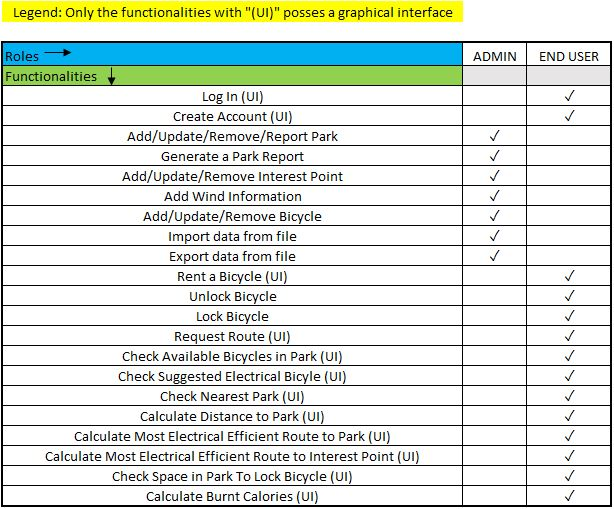
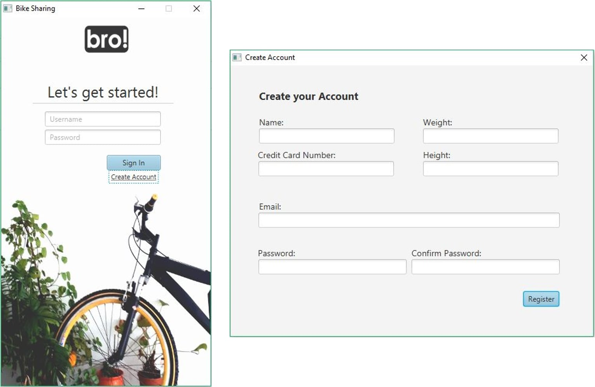
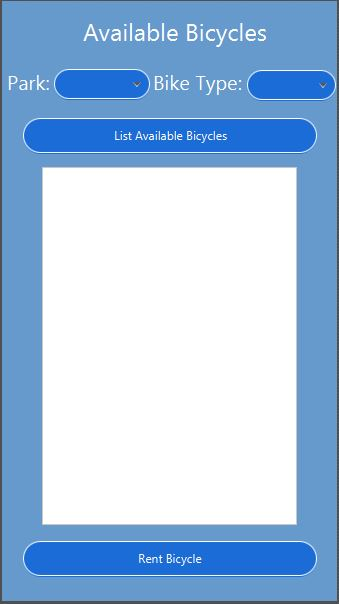
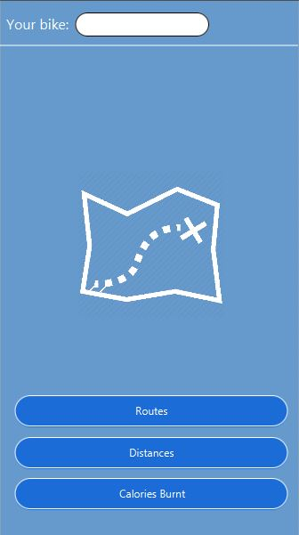
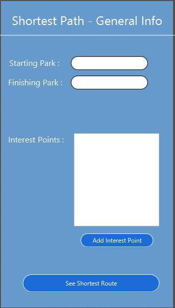
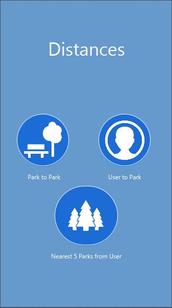
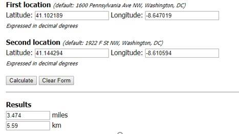
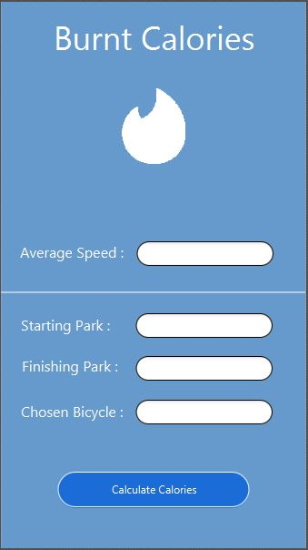

# Report

 

## Abstract 

This report details the development process of a project inserted in the context of “Laboratório Projecto III”, a class in ISEP’s “Engenharia Informática” course.  

The above-mentioned project concerns the implementation of a software solution for a bike-sharing system. With this in mind, we constructed an intuitive and feature-filled software that serves both the end user's and administrator's needs. 

Overall, we consider to have crafted a well-developed solution, in accordance with the problem presented to us. 

#### Keywords 

  - Bicycle 

  - Battery 

  - Park 

  - Slot 

  - Point of interest 

  - Path 
  
  - Distance

  - Energy-efficient 

  - Physics 

  - Rental 

  - Receipt 

  - User 

  - Administrator 

  - Database 

  
##### Tables Index

>[Table 1 - Software Functionalities](Pictures/tab1-functionalities-table.JPG)

##### Figures Index

>[Figure 1 – Login and Registration](Pictures/fig1-login-and-registration.jpg)

>[Figure 2 – Rent Bicycle](Pictures/fig2-rent-bicycle.JPG) 

>[Figure 3 – Main Menu](Pictures/fig3-main-menu.JPG)

>[Figure 4 – Request Route With Interest Points](Pictures/fig4-request-route-with-interest-points.JPG)

>[Figure 5 – Distances Menu](Pictures/fig5-distances-menu.JPG)

>[Figure 6 – Example of the Application of the Haversine Formula](Pictures/fig6-example-haversine-formula.jpg) 

>[Figure 7 – Calculate Burnt Calories](Pictures/fig7-burnt-calories.JPG)

>[Figure 8 – Total Area of Contact](Pictures/fig8-total-area-contact.jpg) 

>[Figure 9 – Drag Force Formula](Pictures/fig9-drag-force-formula.jpg) 

>[Figure 10 – Demonstration of the Gravitational Force](Pictures/fig10-demonstration-gravitational-force.jpg)

>[Figure 11 – Demonstration of the Bearing Resistance](Pictures/fig11-demonstration-bearing-resistance.jpg)

>[Figure 12 – Demonstration of the Weight Force](Pictures/fig12-demonstration-weight-force.jpg) 

>[Figure 13 – Demonstration of the Bearing Angle Calculations](Pictures/fig13-demonstration-bearing-angle-calculations.jpg)

>[Figure 14 – Demonstration of the Wind Direction Angle](Pictures/fig14-demonstration-wind-direction-angle.jpg)

>[Figure 15 – Demonstration of Wind Direction](Pictures/fig15-demonstration-wind-direction.jpg)

 

## Introduction 

For LAPR3, the context of a bicycle sharing business was presented to the students, with the goal for them to develop a software solution capable of managing the business’s users, as well as allowing administrators to control all its bicycles and bicycle parks, including the pickup and return processes of said bicycles. 

To reach this goal, students were instructed to not only adopt an Object-Oriented software design, in conjunction with the programming language Java and the agile Scrum methodology, but also utilize the knowledge acquired in the “Física Apicada” (FSIAP), “Estruturas de Informação” (ESINF) and "Base de Dados” (BDDAD) classes, in order to fully develop all of the software’s functionalities. 

In this report, we will begin by discussing what already available solutions exists for this type of business in a “State-of-the-Art” section, followed by a brief background of the project, including its objectives, and concluding with a detailed explanation of all the software's functionalities, alongside some integral justifications for our design choices. 

## State of the Art  

Currently, moving around in a big city can be very taxing, given their density and the large number of people that live and work there. Furthermore, the degrading state of our planet is one of today’s most pressing issues that needs to be attended sooner rather than later. Taking all of this into consideration, to promote a decrease in the usage of cars in big cities, bicycle sharing systems have been implemented, giving people cleaner and more convenient ways to get to their destinations. 

Examples of these systems exist all over the world[[1]](https://en.wikipedia.org/wiki/List_of_bicycle-sharing_systems), for example, Lisbon’s bicycle sharing solution is called “Gira”[[2]](https://www.gira-bicicletasdelisboa.pt) and utilizes an app, whereby users pay for a daily, monthly or annual pass and, using their smartphones, can unlock and lock bicycles in various stations spread all over town. New York City possesses a similar system called “Citi Bike” with “12,000 bikes” and “750 stations”, spreading across “60 neighborhoods”[[3]](https://www.citibikenyc.com), which proves the existing interest in these types of services. 

Our software aims to present a similar solution, focusing more in its ease of use and quality of life features, while taking into consideration everyone that will utilize our software, thusly improving both the end user experience as well as the managing processes.  

 

## Problem Statement 

Setting up a bike sharing system is no easy task, given the need to store, update and manage a large amount of data in real time, in order to not only present accurate information to the end user in a convenient way, but also facilitate the administration processes as well. Furthermore, it is also necessary to take into consideration that this system will need to work with different types of bicycles, which means that each of them will require specific mechanisms to treat, display, store and update their relevant data. 

Finally, this software solution also needs to not only charge users for using the service, but also implement a “points system” that rewards them for accomplishing specific tasks (for example, parking a bicycle in a park located at a higher altitude than the the staring one), keeping them invested in the service and encouraging them to continue using it.  

 

## Solution 

As we established in the “Problem Statement” section, our software solution was designed with both end users and administrators in mind, taking into consideration both party's needs, with the goal of creating the best possible product for everyone.  

In addition, while the inclusion of a graphical interface wasn’t mandatory, we decide to implement one, as we felt it would enhance the project’s quality, resulting in an overall more polished and intuitive software. However, it is important to note that only the user functionalities possess a graphical interface. 

With this in mind, we have decided to create this simple table to show all our software’s functionalities, in order to more easily contextualize our application before describing its details more thoroughly.  

 

 

**(*Table 1 - Software Functionalities*)** 

 

One of the most significant features of our software is the usage of a database, as all the data used by the application is stored in it. This means that every search, creation, update or removal process that occurs in the application will utilize and manipulate the data present in the database. Moreover, all locations (parks and interest points) are organized in a graph structure, as it proved to be the most efficient way to manage this type of data, given the need to calculate routes between all different locations. 

When starting up the application, a login page appears where the end user can input their login information, in order to utilize the functionalities he has access to. Furthermore, there is also a link to a registration page where unregistered users can create their new account, so that they can use our software. 

 

 

**(*Figure 1 – Login and Registration*)** 

 

After logging in, if the user doesn’t have an active bicycle rental, he will be able to rent a bicycle by choosing a park and type of bicycle, in accordance to his preference. 

 

 

**(*Figure 2 – Rent Bicycle*)** 

 

However, if the user already has an active rental, he is presented with a main menu with various functionalities, divided into easy to understand categories, that were previously unavailable to him. 

 

 

**(*Figure 3 – Main Menu*)** 

 

One of these functionalities is the ability to request a route between two different parks. In order to do so, the user can select the simpler “Park to Park Route” option and mark the two parks that make up his itinerary. However, if he so pleases, the user can otherwise select the more complete “Interest Point Route” option where, after choosing both starting and finishing parks, he is able to add several interest points, from a given list, to his itinerary. In both cases, the software will calculate and present a specific number (previously chosen by the user) of routes in accordance to the inputed data, giving the user a bigger range of options to approach his itinerary.  

 

 

**(*Figure 4 – Request Route With Interest Points*)** 

 

However, if the user intends on using an electric bicycle, he can also view the most energy efficient route between two parks, while also keeping the ability to specify all of his desired interest points. Moreover, the software will not only take into consideration the different possible routes but also the battery charge of all the electric bicycles present in the selected staring park and suggest the most appropriate bicycle for the user to use. 

Furthermore, the application can also calculate a variety of useful distances, in order to help the user plan his route. One of these options calculates the user’s distance to a specific park, given that he indicates the park in question, in addition to his own coordinates, while another displays the nearest five parks in relation to the user's location, and one other simply calculates the distance between two different parks. 

 

 

**(*Figure 5 – Distances Menu*)** 

 

To calculate the distances between two points we implemented in our software the Haversine formula[[4]](https://www.movable-type.co.uk/scripts/latlong.html) that relies on trigonometric circular properties. This formula is widely used in software development, given it returns trustable values that are very approximated to the real ones, in kilometers (km). However, it is not one hundred percent accurate, since it considers the planet as a perfect sphere, something that we acknowledge not being true, but, despite this divergence, the values are so approximate that we can disregard the differences. In addition, this formula also neglects possible irregularities in the terrain (for example, rocks). Nonetheless, even if they do exist, we only contemplate the concept of distance, meaning we always have to take into account the smallest direct connection between both points, regardless of these inconsistencies. 

 

 

**(*Figure 6 – Example of the Application of the Haversine Formula*)** 

 

One more useful functionality our software offers is the calculation of burnt calories in a hypothetical route with an average speed, starting and finishing parks and specific bicycle all defined by the user. This way, he can better analyze his itinerary and realize how riding a bicycle can improve his health, which in turn will, hopefully, incentivise him to continue using our application. 

 

 

**(*Figure 7 – Calculate Burnt Calories*)** 

 

Another key aspect of our software is the fact that both the lock and unlock bicycle processes are automated, necessitating no UI to communicate with the user. With that in mind, after the user locks his bicycle in a park, he will receive an email confirming the success of the operation. 

Additionally, the payment operation is also automatic, requiring no involvement from the user whatsoever. Furthermore, our application supports a points system that rewards the user for specific health friendly bicycle riding actions (such as parking a bicycle in a higher place than the starting one), in which every ten points the user has accumulated in his account are automatically exchanged for a one euro discount in his next invoice.

However, the software doesn’t exclusively provide functionalities to the end user, as the administrators of the system, as well as their managing needs, were taken into consideration during the development of our application. As such, administrators can create, update and remove the data regarding parks, interest points and bicycles. Furthermore, administrators can also add wind information between two parks, thusly providing the end users with more helpful material when they request a route between said parks, and generate a comprehensive report containing all the relevant data of a specific park (number and state of bicycle slots, time remaining to fully charge each locked electric bicycle’s battery, …). 

Administrators also have the ability to not only import but also export data to/from the database, thusly strengthening the system’s security measures and ease of updating data through backup files. Moreover, our software supports multiple file types, in order to improve its flexibility and usability.  

Given that some of the application's core functionalities rely on various calculations involving physics algorithms, we decided it was best to have a specific section within our report in which we better explain our reasoning behind these distinct features. To access said section, click [here](PhysicsAlgorithms.md).

After identifying all the tasks the team needed to complete, and dividing them by all members, we began the analysis and designs processes of each functionality, in which, utilizing the program “Visual Paradigm”, we constructed several diagrams describing each of the software’s functionalities, in order to establish early on all the requirements needed to develop each feature. 

Due to the usage of a database, during the implementation phase of some functionalities, we decided to include the “Mockito” framework [[5]](https://site.mockito.org), in order to simulate a connection between our software and the database, as this was the most technically reliable solution we found to implement the database functionalities within our software. Furthermore, we also constructed several tests to ensure the quality of our code, while also taking care to craft specific tests adapted to the "Mockito" framework, thusly guaranteeing the database functionalities worked as intended. 

 

## Conclusion 

Given the comprehensive complexity of the project, as was demonstrated throughout this report, the need to use organizational tools was evident. Thusly, in order to divide the various tasks between all team members and plan which ones the team should complete in each sprint, we used the online tool “JIRA”. In addition to this, during the discussions about the project’s tasks, we also used the “Poker Scrum” methodology to help the team reach a unanimous estimate of the time needed to complete each task. 

By using these tools, we were able to find the best way to distribute the project’s tasks between all team members, taking into consideration each member’s strengths and weaknesses, as well as the priority and complexity of all the tasks that needed to be completed. 

However, one of our biggest obstacles resided in adapting to the various changes that were introduced to the software structure itself (and not the incremental functionalities that were added throughout the project), as it led to several overhauls of large parts of the application and, consequently, time spent readjusting it multiple times, instead of adding new functionalities or improving the ones that were already implemented. Furthermore, we also had to deal with several technical issues with the tool "JIRA", as it would simply be impossible to connect to it multiple times throughout the project, meaning the team would need to use a chat service (Discord) in order to organize and distribute the tasks by all members and save their work offline, only to upload it to "JIRA" at a later date.

In conclusion, despite the difficulties we felt during this assignment, we think we have achieved our goals for this project and are satisfied with the final result, as we were able to include several functionalities that, although were not mandatory, improved the overall quality of the software, while not compromising on its critical functionalities.  

 

## References 

[1] “List of bicycle-sharing systems | Wikipedia” [Online]. Available: https://en.wikipedia.org/wiki/List_of_bicycle-sharing_systems [Accessed: 23-Dec-2018] 

[2] “GIRA - Bicicletas de Lisboa” [Online]. Available: https://www.gira-bicicletasdelisboa.pt [Accessed: 23-Dec-2018] 

[3] “Citi Bike” [Online]. Available: https://www.citibikenyc.com [Accessed: 23-Dec-2018] 

[4] "Movable Type | Calculate distance, bearing and more between Latitude/Longitude points” [Online]. Available: https://www.movable-type.co.uk/scripts/latlong.html [Accessed: 6-Jan-2019] 

[5] “Mockito framework site” [Online]. Available: https://site.mockito.org [Accessed: 14-Dec-2018]

#### [Back](/Readme.md)