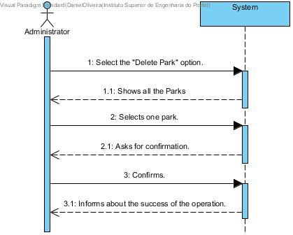

# UC01-Delete Park

## Brief Format

The administrator selects the "Delete Park" option.
The system shows the list of all the parks in the system.
The administrator selects one park. 
The system asks for confirmation.
The administrator confirms. 
The system informs the user about the success of the operation.

## SSD

#### [Back](../UseCases.md)