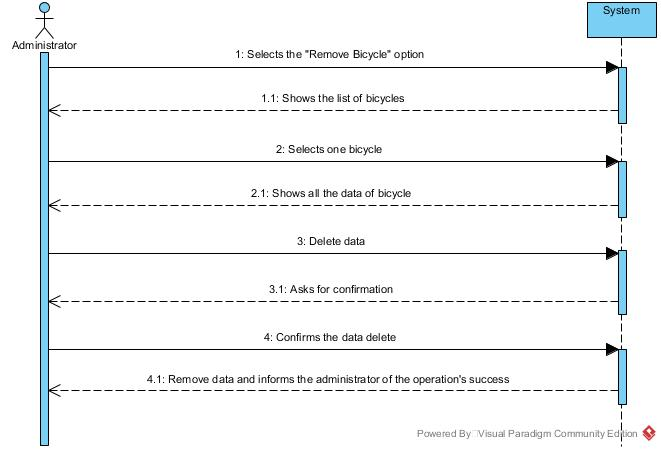

# UC02-Remove Bicycle

## Brief Format

The administrator selects the "Remove Bicycle" option.
The system shows the list of all the Bicycle's in the system.
The administrator selects one bike. 
The system shows all the selected bike's data. 
The administrator selects "Delete" Option.
The system asks for confirmation. 
The administrator confirms. 
The system delete all the information of the bike and informs the user of the success about the operation.

## SSD

#### [Back](../UseCases.md)