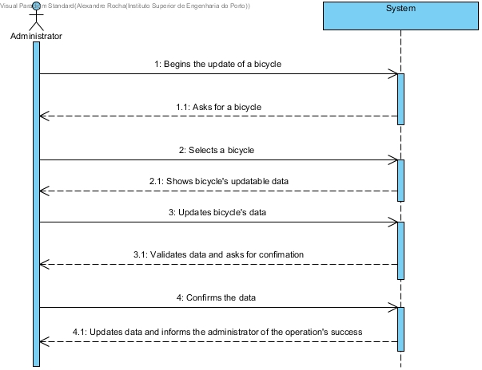

# UC03-Update Bicycle's Information

## Brief Format

The administrator begins the process of updating a bicycle’s data.
The system asks for the bicycle the administrator wishes to update.
The administrator selects the desired bicycle.
The system shows the current updatable information of the selected bicycle.
The administrator updates the desired information.
The system validates the updated data and asks or confirmation.
The administrator confirms.
The system saves the updated data and informs the administrator of the success of the operation

## SSD

#### [Back](../UseCases.md)