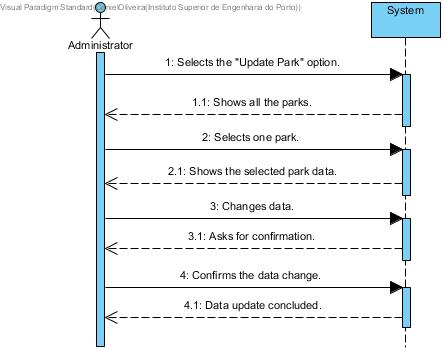

# UC04-Update Park

## Brief Format

The administrator selects the "Update Park" option.
The system shows the list of all the parks in the system.
The administrator selectsone park. 
The system shows all the selected parks data. 
The administrator makes the desired changes to the data of the selected park.
The system validates the updated information and asks for confirmation. 
The administrator confirms. 
The system saves the information and informs the user of the success about the operation.

## SSD

#### [Back](../UseCases.md)