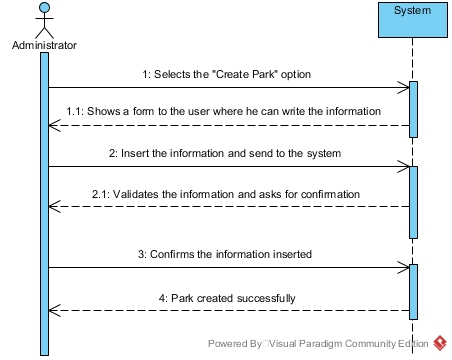

# UC05-Create Park

## Brief Format

The user selects the "Create Park" option.
The system shows a form to the user where he can write the information
The user insert the information and send to the system
The system validates the information and asks for confirmation. 
The user confirms. 
The system saves the information and informs the user of the success about the operation.

## SSD

#### [Back](../UseCases.md)