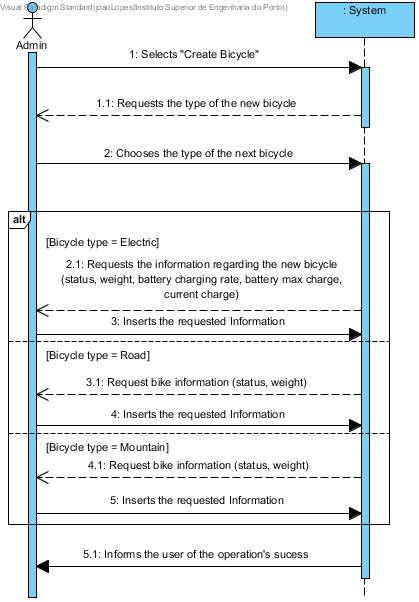

# UC06-Create Bicycle

## Brief Format

The administrator selects "Create Bicycle".
The system opens the Bicycle Creation window, show a list of bicycle types and requests the new bicycle's type.
The administrator selects the new bicycle's type.
The system requests the information regarding the new bicycle.
The administrator inserts the requested information.
The system validates the information, saves the new bicycle and informs the administrator of the success of the operation.

## SSD

#### [Back](../UseCases.md)