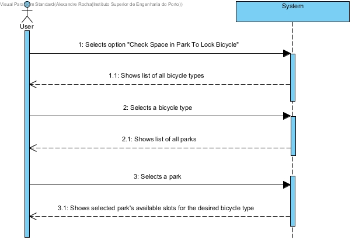

# UC07-Check Space In Park To Lock Bicycle

## Brief Format

The user selects the "Check Space In Park To Lock Bicycle" option.
The system shows the list of all bicycle types and asks for a specific type.
The user selects a bicycle type.
The system shows the list of all the parks and asks for a specific park.
The user selects the desired park.
The system shows the current available space in the desired park for the selected bicycle type.

## SSD

#### [Back](../UseCases.md)