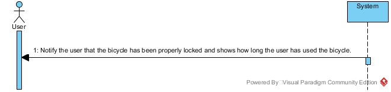

# UC08-Confirmation Bicycle Locked

## Brief Format

The user locks the bicycle after having used.
If the bicycle has been properly locked then the system notify the user that the bicycle has been properly locked and shows how long the user has used the bicycle.

## SSD

#### [Back](../UseCases.md)