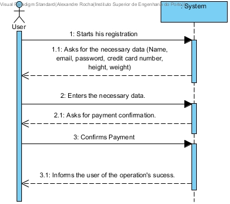

# UC09-Create User

## Brief Format

The User starts his registration in the system.
The System asks for the necessary data (name, email, password, credit card number, height, totalDistance).
The User enters the necessary data. The system asks for the user to confirm the payment information.
The user confirms the payment.
The system validates the data and informs the user of the operation's success.

## SSD

#### [Back](../UseCases.md)