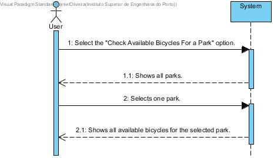

# UC10-List Available Bicycles In Park

## Brief Format

The user selects the "Check Available Bicycles For a Park" option.
The system shows the list of all the parks in the system.
The user selects one park. 
The system shows all the available bicycles for the selected park.

## SSD

#### [Back](../UseCases.md)