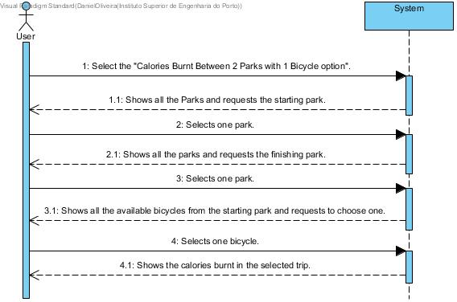

# UC12-Calculate Burnt Calories

## Brief Format

The user selects the "Calories Burnt Between 2 Parks With 1 Bicycle" option.
The system shows the list of all the parks in the system and requests the starting park.
The user selects one park. 
The system shows the list of all the parks in the system and requests the finishing park.
The user selects one park.
The system shows the list of all available bicycles from the starting park and requests to choose one.
The user selects one bicycle.
The system shows the amount of burnt calories in the selected trip.

## SSD

#### [Back](../UseCases.md)