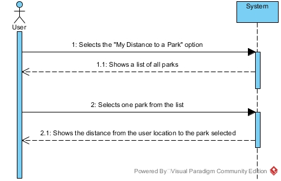

# UC13-Calculate Distance From User To Park

## Brief Format

The user selects the "My Distance to a Park" option.
The system shows a list of all parks.
The user selects one park.
The system shows the distance from the user location to the park selected.

## SSD

#### [Back](../UseCases.md)