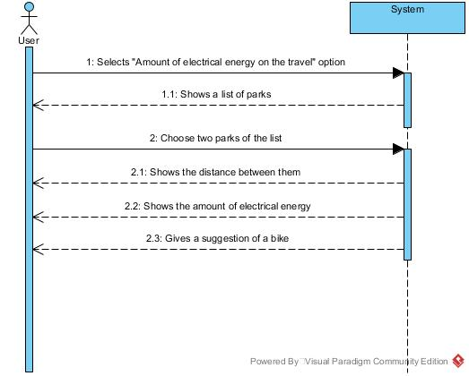

# UC14-Calculate Electrical Energy Spent In Travel

## Brief Format

The user selects the "Amount of electrical energy on the travel" option.
The system shows the list of all the Park's in the system.
The user selects two parks. 
The system shows all the distance between them
The system shows the amount of electrical energy spen on the travel
The system gives a suggestion of a bike to make the travel

## SSD

#### [Back](../UseCases.md)