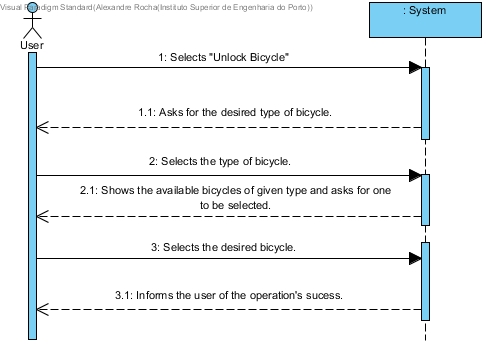

# UC15-Unlock Bicycle

## Brief Format

The user selects "Unlock Bicycle".
The system asks the user for the desired type of bicycle.
The user selects the desired type of bicycle.
The system shows the available bicycles of the given type and asks for one to be selected.
The user selects the desired bicycle.
The system validates the data and informs the user of the operation's success.

## SSD

#### [Back](../UseCases.md)
