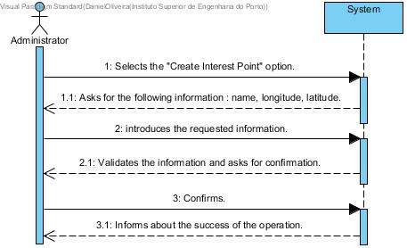

# UC 16 - Create Interest Point

## Brief Format

The administrator selects the "Create Interest Point" option.
The system asks for the following information: name, longitude, latitude.
The administrator introduces the requested information. 
The system validates the information and asks for confirmation.
The administrator confirms.
The system informs about the success of the operation.

## SSD

#### [Back](../UseCases.md)