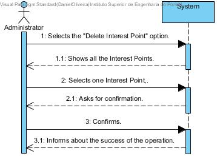

# UC 17 - Delete Interest Point

## Brief Format
The administrator selects the "Delete Interest Point" option.
The system shows all the Interest Points.
The administrator selects one interest point. 
The system asks for confirmation.
The administrator confirms.
The system informs about the success of the operation.

## SSD

#### [Back](../UseCases.md)