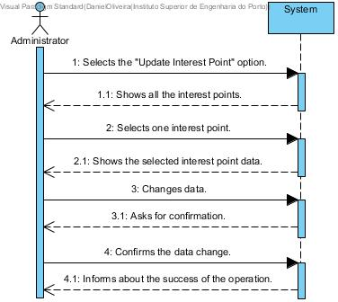

# UC 18 - Update Interest Point

## Brief Format
The administrator selects the "Update Interest Point" option.
The system shows the list of all the interest points in the system.
The administrator selects one interest point. 
The system shows all the selected interest point data. 
The administrator makes the desired changes to the data of the selected interest point.
The system validates the updated information and asks for confirmation. 
The administrator confirms. 
The system saves the information and informs the user of the success about the operation.

## SSD

#### [Back](../UseCases.md)