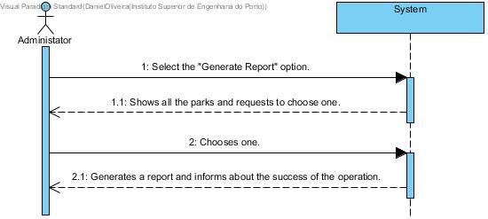

# UC 19 - Generate Report

## Brief Format
The administrator selects the "Generate Report" option.
The system shows the list of all the parks in the system.
The administrator selects one park. 
The system generates a report and informs about the success of the operation.

## SSD

#### [Back](../UseCases.md)