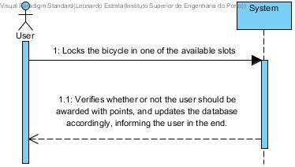

# UC 20 - Award User Points

## Brief Format
The user locks the bicycle in one of the available spots. The system verifies whether or not the user should be awarded with points, and updates the database accordingly, informing the user at the end.

## SSD

#### [Back](../UseCases.md)