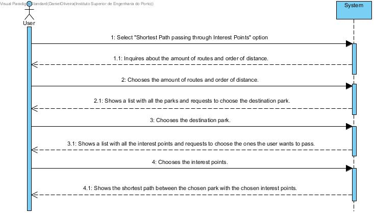

# UC 21 - Shortest Path Between Points Of Interest

## Brief Format
The User selects the "Shortest Path passing through Interest Points" option.
The system inquires about the amount of routes and order of distance.
The User chooses the amount of routes and order of distance.
The system shows the list of all the parks in the system and requests to choose the destination park.
The User selects the destination park. 
The system shows the list with all the interest points and requests to choose the ones the user wants to pass.
The User chooses the interest points.
The system shows the shortest path between the chose parks with the chosen interest points.

## SSD

#### [Back](../UseCases.md)