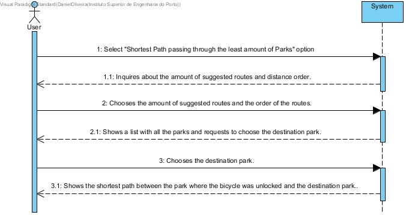

# UC 22 - Shortest Path Between Parks

## Brief Format
The User selects the "Shortest Path passing through least amount of Parks" option.
The system inquires about the amount of suggested routes and distance order.
The User chooses the amount of suggested routes and the distance order.
The system shows the list of all the parks in the system and requests to choose the destination park.
The User chooses the destination park. 
The system shows the shortest path between the park where the bicycle was unlocked and the destination park.

## SSD

#### [Back](../UseCases.md)