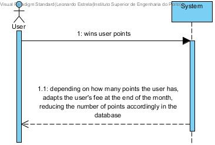

# UC 25 - Discount User's Fee with Points

## Brief Format
The user wins user points;
The System, depending on how many points the user has, adapt's the user's fee at the end of the month, reducing the number of points accordingly in the database.

## SSD

#### [Back](../UseCases.md)