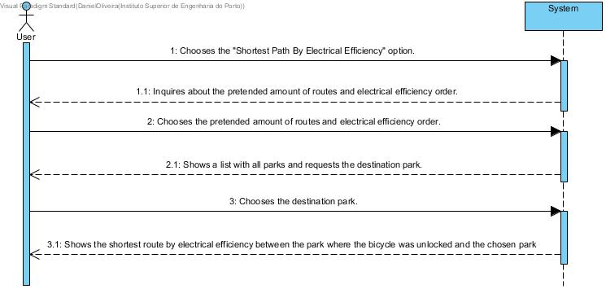

# UC 26 - Shortest Path By Electrical Efficiency

## Brief Format
The User selects the "Shortest Path By Electrical Efficiency" option.
The system inquires about the amount of pretended routes and electrical efficiency order.
The User chooses the amount of pretended routes and electrical efficiency order.
The system shopws a list with all the parks and requests the destination park.
The User chooses the destination park.
The system shows the shortest route by electrical efficiency between the park where the bicycle was unlocked and the chosen park.

## SSD

#### [Back](../UseCases.md)