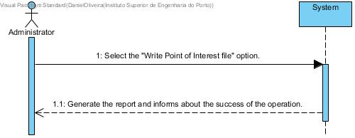

# UC 27 - Write Point of Interest File

## Brief Format
The administrator selects the "Write Point of Interest File" option.
The system generates the point of interest report and informs about the success of the operation.

## SSD

#### [Back](../UseCases.md)