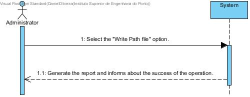

# UC 30 - Write Path File

## Brief Format
The administrator selects the "Write Path File" option.
The system generates the path report and informs about the success of the operation.

## SSD

#### [Back](../UseCases.md)