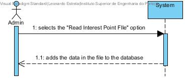

# UC 31 - Read Interest Point File

## Brief Format
The administrator selects the "Read Interest Point File" option.
The system adds the data in the file to the database. 

## SSD

#### [Back](../UseCases.md)