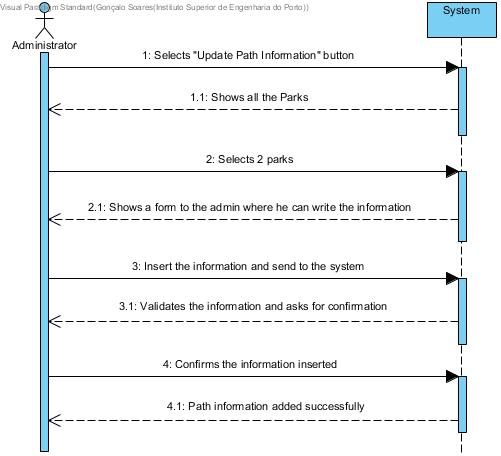

# UC 37 - Update Path Information

## Brief Format
The administrator selects the "Update Path Information" option.
The system shows the list of all the parks in the system.
The administrator selects two park (initial park and final park). 
The system shows a form where the administrator can write the info.
The administrator insert the info and send to the system.
The system validates and ask for confirmation.
The administrator confirms the info.

## SSD

#### [Back](../UseCases.md)